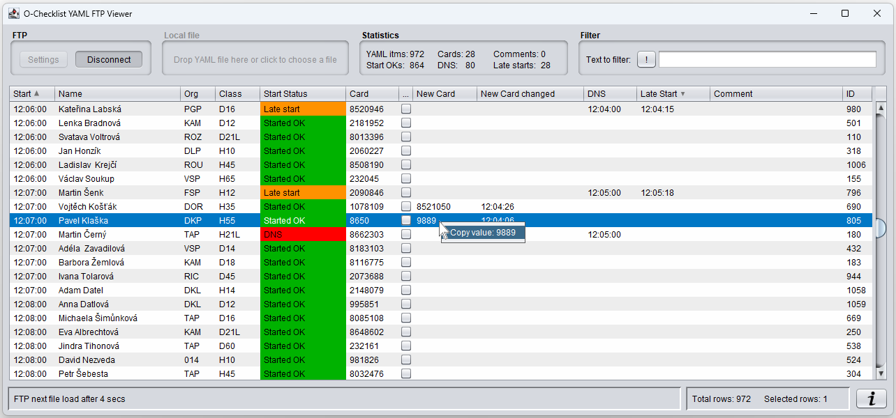
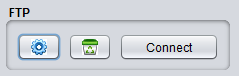
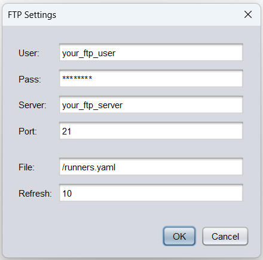
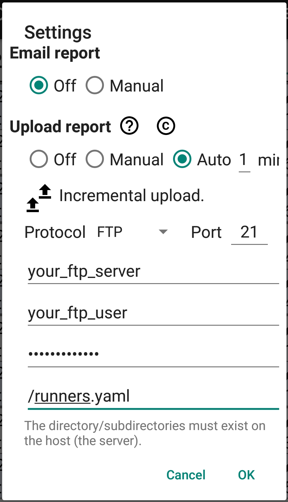
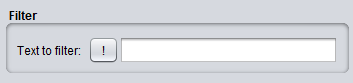
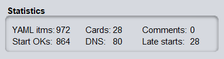
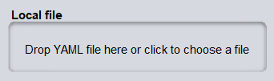
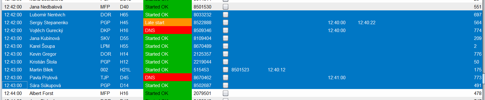
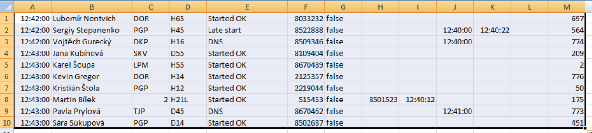
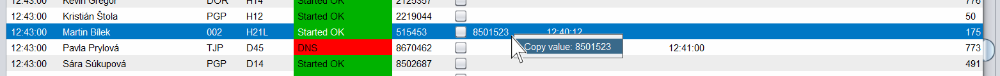

# CZ
## O-Checklist-YAML-FTP-Viewer aplikace
Je JAVA aplikace s podporou:
- online zobrazení YAML souboru zasílaného O-Checklist mobilní Andriod aplikací na FTP server, nebo 
- ruční jednorázové načtení konkrétního YAML soubor.



Další vlastnosti aplikace:
- filtrování přes všechny sloupce podle daného textového řetězce (diakritika je potlačená),
- vícesloupcové řazení dat v tabulce vzestupně/sestupně (dvojklikem na záhlaví sloupce je založeno nové multisloupcové řazení),
- kopírování hodnoty v buňce tabulky pravým klikem myši do clipboardu,
- barevné rozlišení _Started OK_, _DNS_ nebo _Late Start_ záznamů stejné jako v O-Checklist Android aplikace,
- libovolné pořadí a šířka sloupců,
- nastavení FTP parametrů,
- zobrazení základních statistických údajů:
  - počet:
    - záznamů v YAML souboru,
    - DNS závodníků,
    - OK odstartovaných závodníků,
    - změněných čísel čipů,
    - opožděných startů,
    - přidaných komentářů starterem,
  - a ve spodní status řádce: 
    - stav FTP připojení, 
    - celkový počet řádek v tabulce,
    - počet označených řádků v tabulce,
- konfigurační soubor s YAML formátém umožňuje nastavit základní parametry aplikace jako:
  - parametry FTP připojení,
  - zobrazení, rozložení sloupců tabulky a jejich šířky,
  - výchozí řazení dle požadovaných sloupců,
  - výchozí filtrování.

### Spuštění aplikace
#### Důvěřuji autorovi a chci si stáhnout předpřipravenou aplikaci a nechci řešit sestavování JAVA aplikace
Na Google Drive najdeš [složku](https://drive.google.com/drive/folders/1_DBf44yC20Ru7zz8TmXVDBSOE8lbcXJp?usp=drive_link), v které je připraven archiv (.zip, .tgz, .jar) se vším co aplikace pro spuštění potřebuje, není potřeba nic dalšího instalovat.
- Windows .zip archiv: _o-checklist-yaml-ftp-viewer-1.0-win.zip_
- Ubuntu .tgz archiv: _o-checklist-yaml-ftp-viewer-1.0-linux.tgz_
- samotný .jar file:  _o-checklist-yaml-ftp-viewer-1.0.jar_

Po rozbalení .zip nebo .tgz archivu najdeš v adresáři _o-checklist-yaml-ftp-viewer-1.0_ spustitelný soubor _run.bat_ (Windows) nebo _run.sh_ (Linux).
Dvojklikem na tomto souboru bude aplikace spuštěna. 
Při spouštění na OS Windows budeš varován, že spouštíš neznámý software. 


#### Chci si zdrojový kód přečíst, sám sestavit a spustit 
... kód je dostupný na [GitHub](https://github.com/JaroslavBeran/o-checklist-yaml-ftp-viewer), ale zbytek vyžaduje znalosti jak pracovat s GitHub, Maven, Java 


### Konfigurační soubor

Aplikace umožňuje načíst vlastní konfigurační soubor definující:
- rozměry okna aplikace po spuštění,
- parametry FTP připojení,
- šířky jednotlivých sloupečků hlavní tabulky,
- rozmístění (i schování) sloupečků hlavní tabulky,
- předdefinované řazení dle nakonfigurovaných sloupečků (vzestupně/sestupně)
- předdefinovaný filtrační řetězec

Dodržuj odsazování v YAML souboru. V případě špatného odsazení nemusí být konfigurace načtena.
Příklad obsahu konfiguračního souboru:
```yaml
##
## O-Checklist-YAML-FTP-Viewer config file
##

## Note: Be careful and respect the line indentation

version: "1"
appWidth: 1280  # pixels
appHeight: 600  # pixels

ftp:
  server: "your_ftp_server"
  port: 21  # from 1-65535, it is specified by FTP server
  user: "your_ftp_user"
  pass: "your_ftp_pass"
  file: "path_to_the_yaml_file_on_ftp_server_served_by_OChecklist_app"
  refresh: 10  # in seconds


# List of all possible table column identifications:
#    START, NAME, ORG, CARD, CLASS, START_STATUS, NEW_CARD, NEW_CARD_CHANGED, DNS, LATE_START, COMMENT, ID

table:
  # Column width in pixels
  columnWidth:
    START: 65
    NAME: 180
    ORG: 50
    CARD: 76
    CLASS: 64
    START_STATUS: 123
    NEW_CARD: 92
    NEW_CARD_CHANGED: 153
    DNS: 76
    LATE_START: 105
    COMMENT: 190
    ID: 42

  # Column placement from left to right in the table.
  # Commenting the line below makes the column invisible
  columnPlacement: [
    START,
    NAME,
    ORG,
    CARD,
    CLASS,
    START_STATUS,
    NEW_CARD,
    NEW_CARD_CHANGED,
    DNS,
    LATE_START,
    COMMENT,
    ID
  ]

  # Multi-column data sorting definition "column_identification: [ASC|DESC]"
  columnSorting:
    START: DESC
    LATE_START: DESC


# Default filter where negate: true
filter:
  negate: false    # true = negate button is pressed
  token: ""        # text is filled in the "text to filter" text field
```

Konfigurační soubor bude načten při spuštění aplikace pokud bude přidán jako parametr.
Příklad:
```bash
java -jar  o-checklist-yaml-ftp-viewer-1.0.jar  vas_konfiguracni_soubor.yaml
```


### FTP konfigurace
Kliknutím na tlačítko FTP Settings  se zobrazí menu pro konfiguraci FTP parametrů




- _User_, _Pass_ - jsou základní přihlašovací údaje k FTP účtu, 
- _Server_ - je URL adresa Vašeho FTP serveru (může být bez specifikace protokolu, tedy bez "_ftp://_")
- _Port_ - číslo portu, který FTP server používá pro sestavení spojení (většinou 21).
- _File_ - je cesta k souboru, který zasílá O-Checklist android aplikace.
- _Refresh_ - je časová prodleva v sekundách mezi načítáním souboru z FTP serveru.

### Nastavení FTP v Android aplikaci O-Checklist - Upload report:


- Mode "Auto" s intervalem 1 min
- Vypnout "Incremental upload"
- Vyplnit:
  - Port 21
  - ftp server
  - ftp user
  - ftp pass
  - jméno souboru pro uložení dat na FTP serveru (např. _/runners.yaml_) 


### Nastavení FTP serveru
Nastavení přístupu na tvůj FTP server je čistě na tobě :)


#### "Dočasný" FTP účet
Server [WebZdarma](https://www.webzdarma.cz/) umožňuje zdarma založit účet, který podporuje základní FTP server funkcionalitu dostačující pro přenos YAML souboru z Android aplikace O-Checklist do Java aplikace O-Checklist-YAML-FTP-Viewer.


### Filtrování dat


Aplikace umožňuje filtrovat napříč všemy sloupečky.
Stačí zadat textový řetězec do textového pole a aplikace filtruje napříč všemi sloupečky tímto řetězcem bez diakritiky.

Tlačítko s vykřičníkem "!" neguje, tzn. že budou zobrazeny pouze takové řádky, kde ani jedna buňka neobsahuje požadovaný řetězec.

### Mazání tabulky běžců
- Tabulka je automaticky smazána při jednorázovém [ručním nahráním jednoho YAML souboru](#Ruční-nahrání-jednoho-YAML-souboru).
- Kliknutím na tlačítko "Připojení k FTP - Connect" nebo "Odpojení od FTP - Disconnect" není tabulka automaticky smazána. 
Automatické mazání není použité z důvodu editací checkboxů, které by v případě automatického mazání byly ztraceny.

### Statistická data


Zobrazuje malou statistiku načtených dat v posledně načteném YAML souboru:
- _YAML itms_: počet záznamů v YAML načteném souboru,
- _Start OKs_: počet záznamů obsahující "Start OK",
- _Cards_: počet záznamů obsahující změnu čísla čipu,
- _DNS_: počet závodníků, kteří neodstartovali - neorazili si čip při vstupu do koridoru,
- _Comments_: počet záznamů obsahující jakoukolív komentář,
- _Late starts_: počet závodníků, kteří si orazili čip při vstupu do koridoru po jejich plánovaném čase vstupu.

### Ruční nahrání jednoho YAML souboru


Aplikace umožňuje offline načíst YAML soubor.

Klikni na uvedené pole a vyber požadovaný soubor nebo dropni YAML soubor s daty z O-Checklist andriod aplikace.
Tento YAML soubor jsi ručně stáhl z FTP serveru, nebo ti ho někdo zaslal. 


### Vícesloupcové řazení dat v tabulce vzestupně/sestupně
Dvojklikem na záhlaví sloupce začneš nové řazení a kliknutím na každé další záhlaví sloupce je přidáno řazení podle tohoto sloupce.


### Rozdíl mezi počtem YAML záznamů a počtu řádků v tabulce
Android aplikace O-Checklist umožňuje "resetovat" záznam, tedy dovoluje ručně změnit již existující záznam zpět na výchozí stav.
Například je možné změnit záznam "DNS" zpět na "závodník je na seznamu" (bílé podbarvení).
V takovém případě android aplikace O-Checklist tento záznam z YAML odebere.
Mezi tím, ale záznam již mohl být přenesen a zobrazen v tabulce.
V takovém případě záznam o závodníkovi z tabulky nezmizí, bude ale zobrazen přeškrtnutým fontem.
A v takové situaci bude počet YAML záznamu o 1 menší než počet řádků tabulky.

### Kopírování
Aplikace umožňuje dva způsoby kopírování dat z tabulky:
 - vybrané řádky tabulky, nebo
 - vybraná hodnota v buňce tabulky.

#### Vybrané řádky
Po selekci (vybrání) řádku(ů) stačí zmáčknout Ctrl+C a vybrané řádky josu zkopírovány do Clipboardu v tab-separated formátu.
Po vložení do Excelu budou jednotlivé hodnoty vložené do samostatných odpovídajících buněk.




#### Vybraná hodnota v buňce tabulky
Pravým klikem myši na požadované buňce se zobrazí jednořádkové menu s nabídkou zkopírovat danou hodnotu do Clipboardu.

Levým kliknutím na toto menu je hodnota zkopírována do Clipboardu a je možné ji následně vložit (Ctrl+V) do libovolné jiné aplikace.


***

# EN
## O-Checklist-YAML-FTP-Viewer application
The Viewer is Java application showing online YAML entries sent to FTP server from O-Checklist tablet/smartphone app during orienteering running competition.
The Viewer periodically refreshes FTP file and appends new entries to the table. 
You can run the Viewer at the beginning of the competition and then watch the changes.

So there are two viewer modes:
- either FTP online YAML file polling, or
- one statically dropped YAML file from local storage (flashdisk, manually downloaded from FTP, sent by email, etc.)

Following image shows all that stuffs.


The Viewer allows:
- filtering across all columns,
- multi-column data sorting,
- change the column placement, width and visibility,
- copy cell value by right mouse click,
- same colors of _Started OK_, _DNS_ nebo _Late Start_ records as O-Checklist Android app,
- user defined column order,
- FTP settings,
- statistical values:
  - number of:
    - YAML records,
    - DNS competitors,
    - OK started competitors,
    - added comments,
  - at bottom status line:
    - FTP status,
    - total number of table rows,
    - number of selected table rows,
- configuration YAML file:
  - FTP settings,
  - table column layout,
  - initial order,
  - initial filter

And of course the Viewer allows to read just the one YAML file directly by dropping them on specific area or choosing them by file dialog.
Such a yaml file is read only once.


### How to run the Viewer
#### I trust the developer and I want to download prepared package
Go to Google drive folder [folder](https://drive.google.com/drive/folders/1_DBf44yC20Ru7zz8TmXVDBSOE8lbcXJp?usp=drive_link), where I can find package (.zip, .tgz or .jar) what I need to run the app.\ 
- Windows .zip archive: _o-checklist-yaml-ftp-viewer-1.0-win.zip_
- Ubuntu .tgz archive: _o-checklist-yaml-ftp-viewer-1.0-linux.tgz_
- just .jar file:  _o-checklist-yaml-ftp-viewer-1.0.jar_

You can find runnable _run.bat_ (Windows) or _run.sh_ (Linux) after unpacking the package at the _o-checklist-yaml-ftp-viewer-1.0_ folder.
Double click runs the app. You are warn you are running unknown software on OS Windows.


#### I want to read source code and build the app myself
... it requires GitHub, Maven and Java knowledge. 


## Viewer configuration - yaml file
You can define your own configuration where you define basics data for the app.
It is possible to specify:
 - application window size,
 - FTP connection parameters
 - table layout as column placement from left to right, column width, multi-column data order.
 - predefined data order,
 - predefined filter token.

Copy this section and place it to your own yaml file.
Be careful and  respect line indentation in YAML file. If the indentation is corrupted than file cannot be read.

```yaml
##
## O-Checklist-YAML-FTP-Viewer config file
##

## Note: Be careful and respect the line indentation.

version: "1"
appWidth: 1280  # pixels
appHeight: 600  # pixels

ftp:
  server: "your_ftp_server"
  port: 21  # from 1-65535, it is specified by FTP server
  user: "your_ftp_user"
  pass: "your_ftp_pass"
  file: "path_to_the_yaml_file_on_ftp_server_served_by_OChecklist_app"
  refresh: 10  # in seconds


# List of all possible table column identifications:
#    START, NAME, ORG, CARD, CLASS, START_STATUS, NEW_CARD, NEW_CARD_CHANGED, DNS, LATE_START, COMMENT, ID

table:
  # Column width in pixels
  columnWidth:
    START: 65
    NAME: 180
    ORG: 50
    CARD: 76
    CLASS: 64
    START_STATUS: 123
    NEW_CARD: 92
    NEW_CARD_CHANGED: 153
    DNS: 76
    LATE_START: 105
    COMMENT: 190
    ID: 42

  # Column placement from left to right in the table.
  # Commenting the line below makes the column invisible
  columnPlacement: [
    START,
    NAME,
    ORG,
    CARD,
    CLASS,
    START_STATUS,
    NEW_CARD,
    NEW_CARD_CHANGED,
    DNS,
    LATE_START,
    COMMENT,
    ID
  ]

  # Multi-column data sorting definition "column_identification: [ASC|DESC]"
  columnSorting:
    START: DESC
    LATE_START: DESC


# Default filter where negate: true
filter:
  negate: false    # true = negate button is pressed
  token: ""        # text is filled in the "text to filter" text field
```

Add the configuration file as a app parameter.
Příklad:
```bash
java -jar  o-checklist-yaml-ftp-viewer-1.0.jar  vas_konfiguracni_soubor.yaml
```

### FTP konfigurace
Click FTP Settings button  to show FTP dialog.


- _User_, _Pass_ - basic FTP login parameters,
- _Server_ - FTP URL address (can be without protocol specification prefix, e.g. without "_ftp://_"),
- _Port_ - port number (default 21),
- _File_ - ftp file path, where the file is stored from O-Checklist android aplikace.
- _Refresh_ - time refresh ... how often is the ftp file read.

### Nastavení FTP v Android aplikaci O-Checklist - Upload report:


- Choose "Auto" mode with interval 1 min
- Switch off "Incremental upload"
- Fill:
  - Port 21
  - ftp server
  - ftp user
  - ftp pass
  - file name (eg. /runners.yaml) 

### Filtering


It is possible to filter across all columns. 
Fill required string token to the field.

Button with the exclamation "!" negates the filtering.

### Clear the table with runners
- The table is automatically erased during manual file loading or dropping [manual file uploading](#Manual-file-uploading).
- FTP connection doesn't erase the table automatically. The table is not automatically erased due to manual checking the checkboxes (they work as a note for the user he manages the data in some other app).


### Manual file uploading


App allows to manually upload YAML file generated by O-Checklist Android app.
Click the panel or drop the YAML file.

### Statistical data


The statistics of read data from YAML file:
- _YAML itms_: number of YAML records,
- _Start OKs_: number of "Start OK",
- _Cards_: number of changed cards,
- _DNS_: number od not started runners,
- _Comments_: number of records with the comment,
- _Late starts_: number of runners who have started late.


### Difference between the number of YAML records and number of table rows
Android app O-Checklist allows to "reset" competitor's record, so you can change manually competitor's record.
E.g. you can change the runner's "DNS" back to "the runner is listed only" (white background).
Android app O-Checklist removes this runner's record from the YAML file at that case.
Imagine that the YAML file could be already sent among all ends (app-ftp-viewer) and displayed in the table already.
In this case, the runner's record does not disappear from the table, but is only crossed out only and the number of YAML records differs from number of table rows.
Once the runner's state is changed the row is changed in the table as well.


## Copying records
It is possible to copy either selected table rows or the cell value:

#### Selected table rows
It is possible to copy selected rows and put them into Excel.


#### Cell value
Mouse right click allows to copy the cell value to Clipboard.

Clicking the menu the value is copy to Clipboard.

