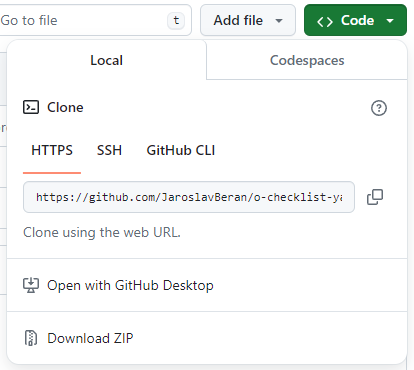

# CZ

K sestavení a spuštění aplikace jsou potřeba 3 věci:
- zdrojové kódy aplikace,
- Java JDK - je vývojové prostředí a základní balíčky pro vývoj Java aplikací,
- Maven - je nástroj pro sestavení/zbuildění výsledné aplikace,

### Zdrojové kódy aplikace
Na hlavní stránce aplikace na GitHub najdeš zelené tlačítko **<>Code**, po kliknutí na něj se zobrazí menu a v jeho spodní části je možné stáhnout zdrojové kódy v .zip archivu (Download ZIP).

Stáhne se ti soubor _o-checklist-yaml-ftp-viewer-master.zip_

### Java JDK
Aplikace je napsaná v Java 17

Na webových stránkách [Oracle](https://www.oracle.com/java/technologies/downloads/#java17) si stáhneš JavaJDK pro svůj OS - Windows, Linux, Mac.

### Maven
- Program Maven lze stáhnout [tady](https://maven.apache.org/download.cgi), stáhněte si "Binary zip archive" například _apache-maven-x.y.z-bin.zip_. V tuto chvíli je aktuální _apache-maven-3.9.8-bin.zip_
- Instalační instrukce pro Maven najdeš [tady](https://maven.apache.org/install.html)

## Sestavení .jar souboru se všemi závislostmi
<code>
$ mvn clean compile assembly:single
</code>

---

# EN

# Build
It is Java 17 project

## Source code
Checkout from GitHub or download .zip source file

## Download JDK 17
https://www.oracle.com/java/technologies/downloads/#java17

Zip of JDK 17 is enough to download:
https://download.oracle.com/java/17/latest/jdk-17_windows-x64_bin.zip

## Build .jar file with all dependencies
<code>
$ mvn clean compile assembly:single
</code>

